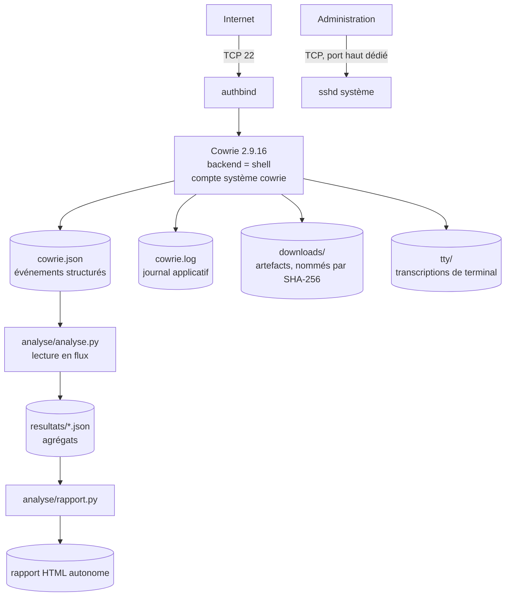

# Honeypot SSH Cowrie

Honeypot SSH exposé sur un VPS public depuis le 1er avril 2026, avec les outils
d'analyse des journaux qu'il produit. Le dépôt contient le code, la
configuration réellement déployée et les résultats agrégés. Les journaux bruts
et les binaires capturés restent sur le serveur.

## Présentation

L'objectif est de mesurer ce que subit une adresse IPv4 banale, sans nom de
domaine et sans publicité d'aucune sorte, dès lors qu'un port 22 y répond. Deux
questions de départ : à quelle vitesse une machine neuve est-elle découverte, et
que cherchent concrètement les attaquants une fois qu'ils croient être entrés.

Le honeypot est à faible interaction. Cowrie tourne en mode `shell`, c'est-à-dire
qu'il simule un shell Linux sans jamais exécuter de commande réelle. L'attaquant
obtient une invite, un faux système de fichiers et des sorties crédibles, mais
aucun processus n'est lancé sur l'hôte.

Ce qui est enregistré pour chaque session :

- connexion entrante, IP et port source, horodatage UTC ;
- bannière du client SSH et algorithmes proposés ;
- identifiants et mots de passe testés, et le verdict de chaque tentative ;
- commandes saisies dans le shell simulé ;
- fichiers que l'attaquant tente de déposer, conservés et empreintés en SHA-256 ;
- demandes d'ouverture de tunnel TCP ;
- transcription du terminal, session par session.

Le trafic observé est du balayage automatisé de masse. Sur la période, aucune
activité manuelle n'a été identifiée.

## Architecture



Le port 22 est servi par Cowrie via `authbind`, ce qui évite de lancer le
honeypot en root. L'administration passe par un port distinct, géré par le
`sshd` du système et sans rapport avec le honeypot. Le détail est dans
[docs/architecture.md](docs/architecture.md).

## Ce que le dépôt sait faire

- agréger plusieurs mois de journaux JSON en un seul passage, y compris les
  fichiers compressés, sans charger les événements en mémoire ;
- produire un rapport HTML autonome, sans dépendance ni CDN ;
- rattacher les commandes observées à des techniques MITRE ATT&CK par
  expressions régulières ;
- fournir trois règles Sigma écrites à partir des comportements réellement
  constatés ;
- surveiller l'espace disque et la fraîcheur des journaux, compresser au besoin
  et alerter par notification sur téléphone ;
- déployer une instance de démonstration isolée, indépendante du serveur réel.

## Stack

Python 3.12, bibliothèque standard uniquement. Cowrie 2.9.16 sur Ubuntu Server
24.04 LTS, service systemd, `authbind`. Supervision par script Bash et
minuterie systemd, alertes via ntfy. Aucune base de données, aucun agent, pas
de conteneur en production.

## Résultats

Période du 1er avril au 24 septembre 2026, soit 177 jours de collecte continue.

| | |
|---|---:|
| Connexions entrantes | 824 801 |
| Adresses IP distinctes | 17 788 |
| Tentatives d'authentification | 809 403 |
| Sessions ayant lancé au moins une commande | 245 765 |
| Commandes exécutées | 363 364 |
| Fichiers déposés | 42 880 |
| Ouvertures de tunnel demandées | 87 052 |

Soit 4 660 connexions par jour en moyenne, avec une progression continue :
67 551 connexions en avril contre 199 263 en août.

Trois observations qui ressortent des données :

`root` concentre 46 % des identifiants testés, et les mots de passe sont
triviaux ou vides. Mais 10 % des tentatives utilisent les chaînes
`345gs5662d34` et `3245gs5662d34`, qui ne sont pas des mots de passe : ce sont
des sondes de détection de honeypot. Un serveur qui les accepte se dénonce.

La routine la plus fréquente après connexion est la pose d'une clé SSH dans
`authorized_keys`, environ 42 000 fois. La clé déposée est presque toujours la
même, retrouvée 41 726 fois, contre 633 pour la deuxième. Le nombre d'adresses
sources ne dit donc rien du nombre d'opérateurs.

Les binaires déposés couvrent dix architectures, dont MIPS, ARM, RISC-V,
LoongArch et Motorola 68000. La cible n'est pas ce serveur en particulier mais
tout ce qui expose un SSH.

Analyse détaillée dans [docs/rapport-2026-04_2026-09.md](docs/rapport-2026-04_2026-09.md),
correspondance ATT&CK dans [docs/mitre-attck.md](docs/mitre-attck.md).

## Installation

Le dépôt ne contient pas de quoi reproduire le serveur exposé, volontairement.
Deux chemins distincts :

- [demo/](demo/) déploie une instance jetable en conteneur, sur un port local,
  pour voir le fonctionnement sans rien exposer ;
- [docs/installation.md](docs/installation.md) documente la procédure réelle,
  sans les paramètres propres à l'hôte en production.

Les outils d'analyse se lancent sans installation :

```bash
python3 analyse/analyse.py chemin/vers/les/journaux -o resultats/stats.json
python3 analyse/rapport.py resultats/stats.json -o resultats/rapport.html
```

Un `Makefile` regroupe les cibles courantes (`make test`, `make lint`,
`make demo`).

## Configuration

Les réglages Cowrie modifiés par rapport au fichier livré sont isolés dans
[config/cowrie.cfg.extrait](config/cowrie.cfg.extrait), avec la raison de
chaque changement. L'unité systemd est dans
[config/cowrie.service](config/cowrie.service).

Les scripts d'analyse n'ont pas de configuration : tout passe par les arguments
de ligne de commande, c'est pourquoi il n'y a pas de fichier d'environnement.

## Journalisation

Format, champs et types d'événements sont décrits dans
[docs/logging.md](docs/logging.md). Des événements synthétiques représentatifs,
en plages d'adresses réservées à la documentation, sont dans
[sample-data/](sample-data/) : ils servent aux tests et aux exemples, et
permettent de lire le format sans manipuler de données réelles.

## Sécurité

Le honeypot est traité comme une machine hostile : compte système dédié non
privilégié, aucune exécution réelle de commande, relais TCP refusé, pas de
secret sur la machine exposée. Les contrôles en place et ceux qui manquent sont
détaillés dans [docs/security.md](docs/security.md), et les scénarios d'attaque
dans [docs/threat-model.md](docs/threat-model.md).

## Limites connues

- **Le disque a saturé le 24 septembre 2026 vers 21 h 40 UTC, et la collecte
  est restée interrompue plus de six jours.** Cowrie acceptait les connexions
  mais ne pouvait plus écrire, et rien ne l'a signalé. Les données de cette
  fenêtre sont inutilisables : le rapport s'arrête au dernier événement
  enregistré avant la saturation. Chronologie dans
  [docs/exploitation.md](docs/exploitation.md). Une supervision avec alertes
  est en place depuis.
- La supervision tourne sur la machine qu'elle surveille. Si le serveur entier
  tombe, plus rien ne le signale : seule une sonde extérieure couvrirait ce
  cas.
- Le taux d'acceptation de 41 % n'est pas une mesure : il découle de la
  politique d'authentification par défaut de Cowrie, qui accepte `root` avec
  presque n'importe quel mot de passe. Expliqué dans le rapport.
- Cowrie est identifiable. Trois versions système incohérentes sont annoncées
  selon l'endroit où l'on regarde, et le nom d'hôte du faux système de fichiers
  est resté au défaut. Détaillé dans [docs/security.md](docs/security.md).
- La correspondance ATT&CK repose sur des expressions régulières : elle donne
  une tendance, pas une classification fiable.
- Faible interaction : ce qui se passerait après l'exécution réelle d'une charge
  utile est hors de portée de ce dispositif.

## Suites

- sonde extérieure au serveur, pour couvrir une panne de la machine entière ;
- limites de ressources et durcissement systemd sur le service ;
- alignement des versions système annoncées par Cowrie, pour réduire la
  détection ;
- enrichissement des adresses par pays et système autonome, croisement avec
  AbuseIPDB ;
- authentification Cowrie explicite via `userdb.txt`, pour que le taux
  d'acceptation devienne un paramètre choisi.

## Licence

MIT, voir [LICENSE](LICENSE).
