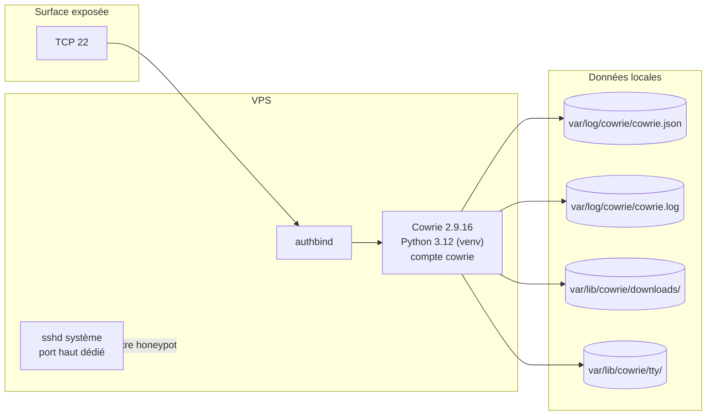
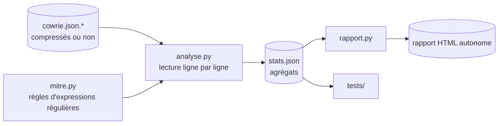

# Architecture

Description du dispositif tel qu'il tourne, pas d'une cible théorique. Les
écarts entre ce qui est en place et ce qui serait souhaitable sont signalés
comme tels et repris dans [security.md](security.md).

## Hôte

| | |
|---|---|
| Machine | VPS, 1 vCore, 1 Go de RAM, 10 Go de SSD (8,7 Go utiles) |
| Hébergeur | IONOS, datacenter en Allemagne |
| Système | Ubuntu Server 24.04 LTS, noyau 6.8 |
| Mises à jour | `unattended-upgrades` actif |

Le plus petit modèle disponible suffit : Cowrie n'exécute rien réellement, il
simule. La charge reste faible même sous plusieurs milliers de connexions par
jour. La vraie contrainte est le disque, pas le processeur, et elle s'est
vérifiée (voir [exploitation.md](exploitation.md)).

## Composants



### Cowrie

Version 2.9.16, installée avec `pip` dans un environnement virtuel Python 3.12
sous `/home/cowrie/cowrie/`. Tourne sous le compte système `cowrie`, sans mot de
passe et sans shell de connexion utile.

Réglages structurants :

| Paramètre | Valeur | Conséquence |
|---|---|---|
| `backend` | `shell` | shell simulé, aucune exécution réelle sur l'hôte |
| port d'écoute SSH | 22 | voir ci-dessous : fixé par un patch du code source, pas par la configuration |
| `[telnet] enabled` | `false` | seul SSH est exposé |
| `forwarding` | `true` | les demandes de tunnel sont acceptées au niveau protocole |
| `forward_tunnel` | `false` | mais aucun octet n'est relayé |
| `forward_redirect` | `false` | et aucune redirection n'est effectuée |
| `sftp_enabled` | `true` | SFTP simulé, permet de capturer les dépôts de fichiers |
| `ttylog` | `true` | transcription complète de chaque session |
| `idle_timeout` | 180 s | ferme les sessions inactives |
| `authentication_timeout` | 120 s | ferme les connexions qui n'authentifient pas |
| `timezone` | UTC | tous les horodatages sont en UTC |
| `auth_class` | `UserDB` | politique d'authentification par table |

Le triplet `forwarding` / `forward_tunnel` / `forward_redirect` mérite d'être
explicite, parce que les journaux comptent 87 052 demandes de tunnel sur la
période : Cowrie accepte la demande au niveau du protocole, l'enregistre, et
n'achemine rien. Le honeypot n'a jamais servi de relais.

### Port d'écoute : un patch du code source

Cowrie écoute par défaut sur le 2222. Le faire écouter sur le 22 a deux
intérêts : c'est là que frappent les bots, et les scanners qui visent le 2222
savent déjà qu'ils cherchent un honeypot.

En production, ce changement **n'est pas fait dans `cowrie.cfg`**. La section
`[ssh]` ne définit aucun `listen_endpoints`, et Cowrie retombe sur la valeur
codée en dur dans `src/twisted/plugins/cowrie_plugin.py`, modifiée à la main au
déploiement :

```python
# ligne 244, en production
listen_endpoints = get_endpoints_from_section(CowrieConfig, "ssh", 22)
# valeur amont : 2222
```

C'est fragile : une mise à jour de Cowrie écrase le fichier, et le honeypot
repasserait silencieusement sur le 2222. La forme correcte serait
`listen_endpoints = tcp:22:interface=0.0.0.0` dans la section `[ssh]` de
`cowrie.cfg`. Elle donne le même résultat et survit aux mises à jour, mais
n'est pas appliquée à ce jour.

La configuration contient par ailleurs une ligne `listen_endpoints = tcp:22`
sous `[backend_pool]`. Elle est sans effet : cette section n'est lue qu'en mode
`proxy`, et le dispositif tourne en mode `shell`. Le détail des écarts est dans
[`config/cowrie.cfg.extrait`](../config/cowrie.cfg.extrait).

### Écoute sur le port 22 sans privilèges

Un processus non root ne peut pas ouvrir un port inférieur à 1024. Deux
solutions existent : une redirection `iptables`, ou `authbind`. C'est `authbind`
qui est utilisé, parce que l'autorisation est lisible en une commande
(`ls /etc/authbind/byport/`) plutôt que dissimulée dans une table de NAT.

L'unité systemd lance `authbind --deep`. Le `--deep` est nécessaire : sans lui
seul le processus parent est autorisé, et Twisted échoue en ouvrant le socket
depuis un enfant.

### Administration

Le `sshd` du système écoute sur un port haut dédié, distinct du 22. Ce service
n'a aucun lien avec Cowrie : il n'est ni simulé, ni journalisé par le honeypot.
Le numéro de port n'est pas publié dans ce dépôt.

## Flux réseau

| Sens | Port | Service | Filtrage |
|---|---|---|---|
| Entrant | 22 | Cowrie | ouvert à tous |
| Entrant | port haut | `sshd` système | ouvert à tous |
| Sortant | tout | — | non filtré |

Le filtrage est réalisé uniquement par le pare-feu de l'hébergeur. Aucune règle
`iptables` ou `nftables` locale n'est en place : les politiques sont à `ACCEPT`
et les tables vides. C'était un choix délibéré au déploiement, pour éviter deux
jeux de règles contradictoires, mais il laisse le trafic sortant entièrement
libre. Ce point est discuté dans [threat-model.md](threat-model.md).

## Flux de données

Cowrie écrit quatre choses, toutes en local, aucune sortie réseau :

| Chemin | Contenu | Volume observé |
|---|---|---|
| `var/log/cowrie/cowrie.json` | un objet JSON par événement, une ligne par objet | ~25 Mo/jour |
| `var/log/cowrie/cowrie.log` | journal applicatif en texte, utile au diagnostic | ~20 Mo/jour |
| `var/lib/cowrie/downloads/` | fichiers déposés, nommés par leur SHA-256 | 267 fichiers, 590 Mo |
| `var/lib/cowrie/tty/` | transcriptions de terminal, format UML | 13 774 fichiers |

Sur les quarante modules de sortie que propose Cowrie, **un seul est activé** :
`output_jsonlog`. Elasticsearch, Prometheus, MISP, VirusTotal, AbuseIPDB,
syslog distant et les autres sont tous désactivés. Il n'y a donc ni base de
données, ni agent, ni tableau de bord, ni export vers un tiers. L'analyse se
fait hors ligne, à partir des fichiers.

### Rotation

Cowrie gère sa rotation lui-même (`logtype = rotating`) : le fichier courant est
basculé chaque jour vers `cowrie.json.AAAA-MM-JJ`. Aucune règle `logrotate`
système n'intervient, et il n'existait au départ aucune compression ni purge
automatique, ce qui a conduit à la saturation du disque.

Les fichiers quotidiens sont désormais compressés par
[`scripts/compresser-journaux.sh`](../scripts/compresser-journaux.sh). Le gain
mesuré est d'un facteur 25 environ, ce qui ramène cinq mois de journaux de 5 Go
à moins de 400 Mo.

Cowrie produit également des fichiers `archive_AAAASS.json.gz` hebdomadaires. La
vérification a montré que **100 % de leurs événements figurent déjà dans le
fichier quotidien correspondant** : les lire en plus revient à compter deux fois.
`analyse.py` les exclut pour cette raison.

## Chaîne d'analyse



`analyse.py` ne garde en mémoire que des compteurs, jamais les événements. Les
lignes de commande sont tronquées à 200 caractères pour le dénombrement, parce
que certains bots envoient des one-liners de plusieurs kilo-octets. C'est ce qui
permet de traiter plusieurs gigaoctets sur une machine à 1 Go de RAM.

La sortie est un JSON unique contenant totaux, distribution par jour et par
heure, classements et comptage ATT&CK. C'est ce fichier que l'on archive, pas
les journaux : il fait une quinzaine de kilo-octets et reste comparable d'un
trimestre à l'autre.

## Ce que l'architecture ne comporte pas

À lire comme une liste d'absences assumées, pour éviter toute ambiguïté :

- pas de conteneur en production, le service tourne directement sur l'hôte ;
- pas de base de données ;
- pas de tableau de bord ni de visualisation temps réel ;
- pas de supervision, donc aucune alerte si la collecte s'arrête ;
- pas de sauvegarde hors machine des journaux ;
- pas de limite de ressources sur le service.

Un `docker-compose.yml` existe dans [demo/](../demo/), mais il sert uniquement à
monter une instance de démonstration jetable. Il ne décrit pas la production.
