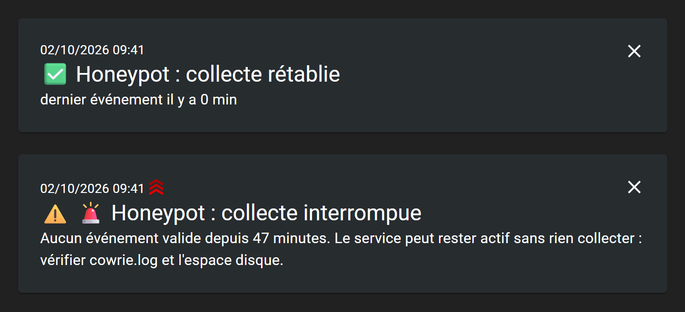
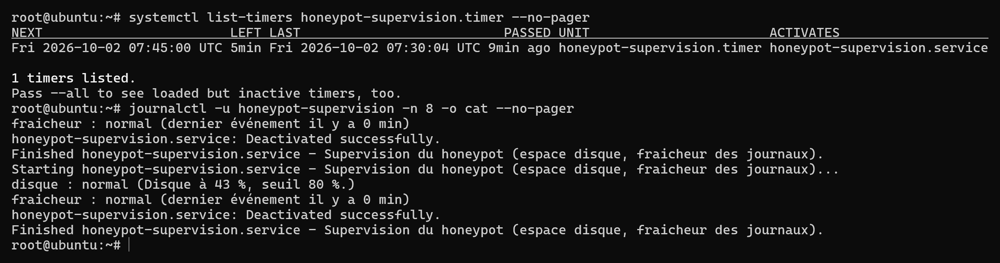

# Exploitation

Gestes courants sur le honeypot en fonctionnement, et retour sur l'incident de
saturation disque du 24 septembre 2026.

## Service

```bash
systemctl status cowrie
systemctl start cowrie
systemctl stop cowrie
systemctl restart cowrie
```

Le service est `Type=forking` avec `Restart=on-failure`. Il redémarre donc seul
si le processus meurt, mais **pas** s'il reste vivant en étant incapable de
travailler. C'est exactement ce qui s'est produit en septembre.

## Supervision

En place depuis le 1er octobre 2026, à la suite de l'incident décrit plus bas.
[`scripts/surveiller.sh`](../scripts/surveiller.sh) tourne toutes les quinze
minutes, lancé par une minuterie systemd, et fait deux contrôles.

| Contrôle | Déclenchement | Réaction |
|---|---|---|
| Espace disque | occupation à 80 % ou plus | compression automatique des journaux ; alerte seulement si cela ne suffit pas |
| Fraîcheur | dernier événement JSON valide vieux de plus de 30 min | alerte |

Le contrôle de fraîcheur est celui qui compte le plus. Il porte sur le dernier
événement **valide**, pas sur la date de modification du fichier : pendant
l'incident, le fichier continuait de grossir avec des écritures tronquées, et
une surveillance fondée sur sa date l'aurait jugé en parfaite santé. Ce contrôle
couvre aussi les pannes sans rapport avec le disque, comme un service figé ou un
port perdu après une mise à jour.

### Alertes

Les alertes sont envoyées par [ntfy](https://ntfy.sh), qui les pousse sur un
téléphone via son application, sans compte. Une anomalie déclenche une
notification au moment où elle apparaît, un rappel toutes les six heures tant
qu'elle dure, et un message quand tout redevient normal. Le même problème ne
produit donc pas une alerte tous les quarts d'heure.



Une alerte et son retour à la normale, tels qu'ils s'affichent dans
l'application web de ntfy. Ces deux messages ont été envoyés par le script de
supervision sur un canal de test, en simulant un journal figé depuis
47 minutes.

Pour recevoir les alertes, installer l'application ntfy puis s'abonner au canal
dont le nom figure dans la configuration du serveur :

```bash
sudo grep '^NTFY_TOPIC=' /etc/honeypot-supervision.conf
```

Ce nom fait office de secret : quiconque le connaît peut lire les alertes et en
publier de fausses. Il est généré aléatoirement, stocké dans un fichier lisible
par root seulement, et ne figure pas dans ce dépôt. Les messages transitent par
le serveur public `ntfy.sh` ; ils ne contiennent que des pourcentages et des
durées, jamais l'adresse du serveur.

### Vérifier la supervision elle-même

```bash
systemctl list-timers honeypot-supervision.timer   # prochain passage
journalctl -u honeypot-supervision.service -n 20   # derniers résultats
cat /var/lib/honeypot-supervision/*                 # anomalies en cours
sudo /opt/honeypot/surveiller.sh --test             # notification de test
```



Si une notification ne part pas, ntfy injoignable par exemple, l'unité se
termine en échec et apparaît dans `systemctl --failed`. Il reste un angle mort :
si la machine entière tombe, plus rien ne tourne pour le signaler. Seule une
sonde extérieure au serveur couvrirait ce cas.

### Confinement

Le service tourne en root, pour rester indépendant du compte `cowrie` qu'un
attaquant sorti du shell simulé viserait en premier. Ses droits sont ensuite
réduits par systemd : système de fichiers en lecture seule à l'exception du
dossier des journaux, trois capacités conservées pour la seule compression,
128 Mo de mémoire au plus. `systemd-analyze security` lui attribue un niveau
d'exposition de 3,8 sur 10, contre 9,2 pour `cowrie.service`, qui n'est pas
encore durci (voir [security.md](security.md)).

L'installation est décrite dans [installation.md](installation.md).

## Vérifier à la main que la collecte fonctionne

`systemctl is-active cowrie` ne suffit pas. Le service peut être actif et ne
plus rien enregistrer. La seule vérification qui compte est la fraîcheur du
dernier événement :

```bash
tail -c 4000 /home/cowrie/cowrie/var/log/cowrie/cowrie.json \
  | grep -o '"timestamp":"[^"]*"' | tail -1
date -u +%Y-%m-%dT%H:%M:%S
```

Si l'écart entre les deux dépasse quelques minutes, il y a un problème. Sur ce
honeypot, le trafic est continu : une absence d'événement sur dix minutes n'est
jamais normale.

Un contrôle complémentaire, qui détecte les écritures partielles :

```bash
# compte les lignes JSON valides du jour
python3 -c "
import json
ok = casse = 0
for l in open('/home/cowrie/cowrie/var/log/cowrie/cowrie.json', errors='replace'):
    l = l.strip()
    if not l.startswith('{'): continue
    try: json.loads(l); ok += 1
    except ValueError: casse += 1
print('valides', ok, '| illisibles', casse)
"
```

## Surveiller le disque

C'est la contrainte dimensionnante de ce dispositif, pas le processeur.

```bash
df -h /
du -sh /home/cowrie/cowrie/var/log/cowrie \
       /home/cowrie/cowrie/var/lib/cowrie/downloads \
       /home/cowrie/cowrie/var/lib/cowrie/tty
```

Ordre de grandeur mesuré : environ 25 Mo de `cowrie.json` et 20 Mo de
`cowrie.log` par jour, non compressés. Sur un disque de 10 Go, cela laisse à peu
près quatre mois avant saturation si rien n'est purgé.

## Rotation et compression

Cowrie bascule son fichier courant chaque jour, mais ne compresse rien et ne
purge rien. La compression est faite par le script du dépôt. La supervision le
lance d'elle-même dès que le disque atteint 80 % ; on peut aussi le lancer à la
main :

```bash
./scripts/compresser-journaux.sh
./scripts/compresser-journaux.sh --simulation   # affiche sans rien modifier
```

Le gain mesuré est d'un facteur 25 environ sur les fichiers JSON. En pratique,
cinq mois de journaux sont passés de 5,0 Go à 383 Mo. Les fichiers compressés
restent exploitables directement : `analyse.py` lit le `.gz` de façon
transparente.

Les transcriptions de terminal grossissent en nombre de fichiers plus qu'en
volume. Une fois les commandes extraites des journaux JSON, elles n'apportent
plus grand-chose :

```bash
find /home/cowrie/cowrie/var/lib/cowrie/tty -type f -mtime +30 -delete
```

## Lancer une analyse

Depuis le serveur, sur l'ensemble des journaux :

```bash
python3 analyse/analyse.py /home/cowrie/cowrie/var/log/cowrie \
  -o resultats/stats.json
```

Sur une période précise, les motifs de nom de fichier suffisent :

```bash
python3 analyse/analyse.py /home/cowrie/cowrie/var/log/cowrie/cowrie.json.2026-07-* \
  -o resultats/juillet.json
```

L'empreinte mémoire reste constante quel que soit le volume : seuls des
compteurs sont conservés. Un passage sur 177 fichiers et plusieurs gigaoctets
tient sans difficulté sur la machine à 1 Go de RAM.

Attention à un piège : ne pas inclure les fichiers `archive_*.json.gz` en plus
des fichiers quotidiens. Leurs événements sont intégralement dupliqués et les
compteurs seraient faussés. `analyse.py` les exclut par défaut.

## Diagnostic

Le journal applicatif est la bonne entrée quand le service se comporte mal :

```bash
tail -50 /home/cowrie/cowrie/var/log/cowrie/cowrie.log
grep -c "No space left" /home/cowrie/cowrie/var/log/cowrie/cowrie.log
grep "Traceback" /home/cowrie/cowrie/var/log/cowrie/cowrie.log | tail -5
```

| Symptôme | Cause probable |
|---|---|
| Service actif, aucun événement récent | disque plein, ou observateur de logs Twisted en erreur |
| `Connection lost after 0.0 seconds` en masse | écriture des transcriptions TTY impossible |
| Rien n'écoute sur le 22 | `authbind` mal autorisé, ou `ssh.socket` a repris la main |
| Lignes JSON tronquées | écriture interrompue, bénin, l'analyse les ignore |

Vérifier ce qui écoute :

```bash
ss -tlnp | grep ':22 '
ls -l /etc/authbind/byport/22   # doit appartenir au compte cowrie
```

## Incident du 24 septembre 2026

Le dispositif est resté plus de six jours sans collecter. L'épisode est
documenté ici parce qu'il est plus instructif que le reste de cette page.

### Chronologie

Reconstituée à partir des événements valides présents dans les journaux.
Heures en UTC.

| Date | Fait |
|---|---|
| 4 septembre | disque à 90 %, relevé sans suite |
| 24 septembre, 21 h 40 | dernier événement valide avant la saturation. La journée en compte 20 822 |
| 25 au 30 septembre | `OSError: [Errno 28] No space left on device` dans `cowrie.log`. Chaque jour, entre 88 et 454 événements passent dans les 5 à 35 minutes qui suivent le basculement de minuit, puis plus rien pendant 23 h 30 |
| 1er octobre, 0 h à 2 h 40 | 40 585 événements en moins de trois heures, soit soixante fois le rythme normal, et 6 181 transcriptions de terminal vides. Vraisemblablement des sessions qui échouent aussitôt ouvertes, faute de pouvoir écrire, et des bots qui se reconnectent en boucle |
| 1er octobre, 2 h 40 | l'observateur de logs Twisted lève une exception. Plus aucune ligne JSON valide n'est écrite, alors que le fichier continue de grossir par écritures partielles |
| 1er octobre, 12 h 15 | détection, libération d'espace, redémarrage du service, collecte rétablie |

### Pourquoi la panne est passée inaperçue

Trois raisons qui se cumulent :

1. `systemctl is-active cowrie` répondait `active` du début à la fin. Le
   processus était vivant, simplement incapable d'écrire.
2. `Restart=on-failure` ne couvre pas ce cas : il n'y a pas eu d'échec, donc pas
   de redémarrage.
3. Aucune supervision n'était en place. Rien ne surveillait l'espace disque ni
   la fraîcheur du dernier événement.

### Correctif appliqué

Vidage du cache APT pour retrouver de l'espace immédiatement, puis redémarrage
du service — l'observateur de logs Twisted ne se rétablit pas seul après un
échec d'écriture. Ensuite, compression de l'ensemble des journaux quotidiens,
qui a ramené l'occupation du disque de 100 % à 41 %.

### Cause racine, corrigée

L'absence d'alerte a été traitée le jour même par la supervision décrite plus
haut. Rejouée sur les journaux réels de la panne, elle aurait réagi à deux
niveaux.

La compression automatique se serait déclenchée bien avant : le disque était
déjà à 90 % le 4 septembre, au-dessus du seuil de 80 %. La saturation n'aurait
vraisemblablement pas eu lieu.

Si elle avait eu lieu malgré tout, le contrôle de fraîcheur se serait déclenché
le 24 septembre à 22 h 10, trente minutes après le dernier événement valide, au
lieu des six jours et demi qu'il a fallu. Les rafales qui suivaient chaque
minuit l'auraient brièvement fait repasser au vert, avant une nouvelle alerte
une demi-heure plus tard. C'est bruyant, mais impossible à manquer.

Les scénarios ont été testés avant la mise en service, y compris le cas exact
de l'incident : un journal volumineux, modifié récemment, mais sans aucune ligne
exploitable.

### Conséquence sur les données

La fenêtre du 24 septembre 21 h 40 au 1er octobre 12 h 15 est inexploitable.
Les rapports s'arrêtent donc au dernier événement enregistré avant la
saturation, et cette coupure est signalée partout où les
chiffres sont présentés. Les données antérieures ne sont pas affectées.
