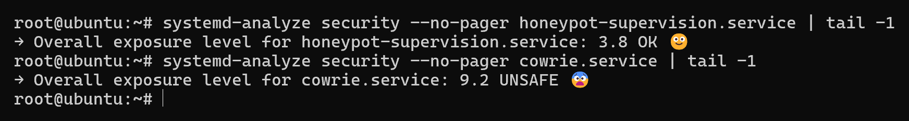

# Sécurité

Un honeypot est une machine que l'on expose délibérément à du trafic hostile. La
question n'est donc pas de l'empêcher d'être attaquée, mais de limiter ce qu'une
compromission permettrait, et d'éviter qu'elle serve contre des tiers.

Cette page sépare strictement ce qui est en place de ce qui ne l'est pas. Les
manques sont listés, pas dissimulés.

## En place

### Pas d'exécution réelle

Cowrie tourne en `backend = shell`. Il simule un shell, un faux système de
fichiers et des sorties plausibles, sans jamais lancer de processus sur l'hôte.
Une commande `wget` saisie par un attaquant est enregistrée et la charge est
récupérée pour analyse, mais rien n'est exécuté.

C'est le contrôle le plus important du dispositif, et il rend sans objet des
classes entières de risques : évasion de conteneur, exécution de code,
persistance réelle. La surface restante est Cowrie lui-même, c'est-à-dire du
code Python et Twisted.

### Aucun relais TCP

`forward_tunnel` et `forward_redirect` sont à `false`. Cowrie accepte la demande
d'ouverture de tunnel au niveau du protocole, l'enregistre, et n'achemine aucun
octet. Sur la période, 87 052 demandes ont été reçues, visant très majoritairement
des adresses sur le port 80 : des tests de connectivité, destinés à vérifier que
la machine peut servir de proxy. Aucune n'a abouti.

Ce point mérite d'être vérifié après toute mise à jour de Cowrie : laisser le
relais actif transformerait le honeypot en proxy ouvert, donc en instrument
d'attaque contre des tiers.

### Compte non privilégié

Le service tourne sous le compte système `cowrie`, sans mot de passe. Pour
écouter sur le port 22 sans être root, `authbind` accorde l'autorisation au seul
port nécessaire :

```bash
ls -l /etc/authbind/byport/22   # appartient à cowrie, mode 770
```

Le choix d'`authbind` plutôt qu'une redirection `iptables` est lisible :
l'autorisation se constate avec un `ls`, pas en déroulant une table de NAT.

### Séparation honeypot / administration

Le `sshd` du système écoute sur un port haut dédié, distinct du 22 servi par
Cowrie. `ssh.socket` est désactivé, sans quoi il garderait la main sur le port 22
et la configuration de `sshd` serait ignorée. Le numéro du port d'administration
n'est pas publié dans ce dépôt.

### Un seul secret sur la machine exposée

Un seul module de sortie est activé, `output_jsonlog`, qui écrit en local. Les
quarante autres sont désactivés, ce qui évite d'avoir à stocker des jetons
d'API, des identifiants de base de données ou des clés d'accès sur une machine
destinée à être attaquée.

Le seul secret présent est le nom du canal ntfy utilisé par la supervision,
dans un fichier lisible par root seulement. Sa fuite permettrait de lire les
alertes et d'en publier de fausses, sans donner aucun accès au serveur.

Les journaux ne partent pas en continu : pas de syslog distant, pas d'export
vers une base. En temps réel, les seules données transmises à un tiers sont les
alertes de la supervision, qui ne contiennent que des pourcentages et des
durées. La publication des journaux en données ouvertes est une opération
manuelle, décrite ci-dessous.

### Données publiées sans l'adresse du serveur

Les journaux sont publiés en données ouvertes (voir [donnees.md](donnees.md)).
Retirer le champ de destination n'aurait pas suffi : des outils d'attaque
avaient glissé l'adresse du serveur dans 188 bannières, 12 mots de passe et
3 commandes. L'export la remplace donc dans tous les champs. Elle lui est passée
en argument et n'apparaît nulle part dans le dépôt.

Avant publication, le contenu même des archives a été relu : aucune occurrence
de l'adresse, ni d'aucune autre du même sous-réseau. Les transcriptions de
terminal ne sont pas publiées : le faux `ifconfig` de Cowrie y affiche
l'adresse réelle, avec l'adresse de diffusion qui révèle le sous-réseau.

### Surface réduite

Telnet est désactivé. Seul SSH est exposé. Les seuls ports en écoute sont le 22,
servi par Cowrie, et le port d'administration.

### Mises à jour

`unattended-upgrades` est actif, avec mise à jour automatique des listes et
application des correctifs de sécurité.

### Supervision

Depuis le 1er octobre 2026, `scripts/surveiller.sh` contrôle toutes les quinze
minutes l'espace disque et la fraîcheur du dernier événement valide. Il
compresse les journaux au-delà de 80 % d'occupation et alerte par notification
sur téléphone. C'est la réponse directe à l'incident du 24 septembre, pendant
lequel le honeypot est resté plus de six jours en apparence actif sans rien
collecter (voir [exploitation.md](exploitation.md)).

Le point compte aussi pour la sécurité : saturer le disque est à la portée d'un
attaquant, et suffisait à aveugler le capteur sans que personne ne le sache.

Le service de supervision est lui-même confiné. Il tourne en root pour ne pas
dépendre du compte `cowrie`, mais systemd ne lui laisse qu'un système de
fichiers en lecture seule, hors dossier des journaux, et trois capacités
réservées à la compression. `systemd-analyze security` lui attribue un niveau
d'exposition de 3,8 sur 10.

Sa limite : il tourne sur la machine qu'il surveille. Une panne de l'hôte
entier ne serait signalée par rien.

## Absent

Ces points sont des manques réels, constatés à l'audit. Ils ne sont pas
implémentés.

### Aucun durcissement systemd

L'unité ne comporte aucune directive d'isolation ni aucune limite :

| Directive | Valeur actuelle |
|---|---|
| `NoNewPrivileges` | non définie |
| `ProtectSystem` | non définie |
| `PrivateTmp` | non définie |
| `MemoryMax` | illimité |
| `CPUQuota` | non définie |

`systemd-analyze security` attribue à `cowrie.service` un niveau d'exposition
de 9,2 sur 10, qualifié de « UNSAFE ». Pour comparaison, le service de
supervision, durci, obtient 3,8.



Sur une machine à 1 Go de RAM dont le processus occupe déjà environ 290 Mo,
l'absence de `MemoryMax` signifie qu'une fuite ou une charge anormale peut
emporter la machine entière.

### Aucun pare-feu local, trafic sortant libre

`iptables` et `nftables` ont toutes leurs politiques à `ACCEPT`, sans aucune
règle. Le filtrage repose uniquement sur le pare-feu de l'hébergeur, qui ne
couvre que l'entrant.

Cowrie n'exécute rien et ne relaie rien, mais il émet tout de même. Quand un
attaquant lance `wget` ou `curl`, Cowrie télécharge réellement la charge pour
la capturer : l'attaquant choisit donc vers quelle adresse le serveur envoie une
requête, et peut s'en servir pour viser un tiers. C'est une requête par
commande, sans relais de trafic, mais rien n'en borne la destination. Et il n'y
a aucune défense en profondeur : une vulnérabilité dans Cowrie ou dans Twisted
permettrait de sortir librement.

### Taille des dépôts non bornée

`download_limit_size` n'est pas défini, ce qui vaut « aucune limite ». Un
attaquant peut donc faire déposer un fichier arbitrairement grand. Combiné à
l'absence de supervision du disque, cela constitue un déni de service simple à
déclencher.

### Administration par mot de passe

| Réglage | Valeur | Remarque |
|---|---|---|
| `PermitRootLogin` | `yes` | connexion directe en root |
| `PasswordAuthentication` | `yes` | mot de passe accepté |
| `authorized_keys` | vide | aucune clé publique installée |
| `MaxAuthTries` | 6 | |
| `X11Forwarding` | `yes` | inutile sur un serveur sans interface |
| `AllowTcpForwarding` | `yes` | inutile pour cet usage |

L'accès administrateur repose donc entièrement sur un mot de passe, en root. Le
port non standard limite le bruit de fond mais ne constitue pas une protection.
Il n'y a pas de `fail2ban`.

### Pas de sauvegarde hors machine

Les journaux et les artefacts n'existent qu'à un seul endroit. Une perte du VPS
emporte six mois de collecte.

## Cowrie est identifiable

Trois versions système incohérentes sont annoncées selon l'endroit où un
attaquant regarde :

| Source | Valeur annoncée | Époque |
|---|---|---|
| Bannière SSH (`[ssh] version`) | `OpenSSH_9.2p1 Debian-2+deb12u3` | Debian 12, 2023 |
| Shell simulé (`[shell] ssh_version`) | `OpenSSH_7.9p1` | Debian 10, 2018 |
| Noyau annoncé (`[shell] kernel_version`) | `3.2.0-4-amd64` | Debian 7, 2012 |

Par ailleurs `honeyfs/etc/hostname` contient toujours `svr04`, la valeur livrée
par défaut avec Cowrie, alors que `cowrie.cfg` définit `hostname = ubuntu-server`.
Le shell affiche donc un nom, et `cat /etc/hostname` en renvoie un autre, qui est
de surcroît une signature connue.

Ce n'est pas théorique. Les données montrent que 10 % des tentatives
d'authentification utilisent les chaînes `345gs5662d34` et `3245gs5662d34`, qui
servent uniquement à détecter un honeypot : un serveur qui les accepte se
dénonce. La détection fait partie de l'outillage courant, et ces incohérences la
rendent triviale.

Corriger ces valeurs est à faible risque et figure dans les suites du
[README](../README.md).

## Priorités

Dans l'ordre, en tenant compte du rapport entre effet et effort :

1. `MemoryMax` et durcissement systemd sur `cowrie.service` ;
2. clé publique pour l'administration, puis `PasswordAuthentication no` et
   désactivation de `X11Forwarding` et `AllowTcpForwarding` ;
3. `download_limit_size` borné ;
4. alignement des versions annoncées et du nom d'hôte du faux système de
   fichiers ;
5. sonde extérieure au serveur, pour couvrir une panne de la machine entière ;
6. sauvegarde des agrégats hors machine.
